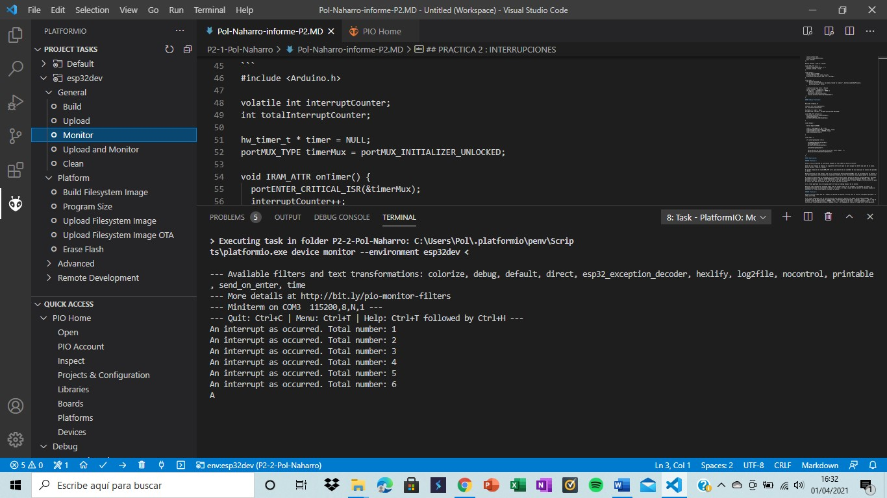

Pol Naharro
## PRACTICA 2 : INTERRUPCIONES PARTE B

##### Código Practica B: 

```
#include <Arduino.h>

volatile int interruptCounter;
int totalInterruptCounter;
 
hw_timer_t * timer = NULL;
portMUX_TYPE timerMux = portMUX_INITIALIZER_UNLOCKED;
 
void IRAM_ATTR onTimer() {
  portENTER_CRITICAL_ISR(&timerMux);
  interruptCounter++;
  portEXIT_CRITICAL_ISR(&timerMux);
 
}
 
void setup() {
 
  Serial.begin(115200);
 
  timer = timerBegin(0, 80, true);
  timerAttachInterrupt(timer, &onTimer, true);
  timerAlarmWrite(timer, 1000000, true);
  timerAlarmEnable(timer);
 
}
 
void loop() {
 
  if (interruptCounter > 0) {
 
    portENTER_CRITICAL(&timerMux);
    interruptCounter--;
    portEXIT_CRITICAL(&timerMux);
 
    totalInterruptCounter++;
 
    Serial.print("An interrupt as occurred. Total number: ");
    Serial.println(totalInterruptCounter);
 
  }
}
```
##### Explicación:

###### Practica B: 

Esta práctica al igual que la A también se divide por partes, en este caso se ven dos claramente marcados, el setup y el loop.

En el setup comenzamos con la instrucción que nos permitirá mostrar las dadas Serial.begin(115200). Las siguientes son de declaración del temporizador (timerAttachInterrupt(timer, &onTimer, true); ) y de lo que ha de hacer (timerAlarmWrite(timer, 1000000, true); ) y cuando lo ha de hacer (timerAlarmEnable(timer); ). La instrucción (timerAlarmWrite(timer, 1000000, true); ) el 1000000 nos indica el tiempo entre interrupciones.

En el loop podemos apreciar que se ha realizará siempre que interruptCounter sea mayor que 0 se imprimirá por pantalla que hay una interrupción, y el número que es, gracias a las siguientes instrucciones Serial.print("An interrupt as occurred. Total number: "); Serial.println(totalInterruptCounter);. El número se va actualizando por esta instrucción totalInterruptCounter++;.

Para resumir el funcionamiento de la práctica primero se crea el temporizador y luego con el loop se realizan todas las interrupciones y se muestran por pantalla.

##### Funcionamiento de la práctica:

###### Practica B

Comprobación interrupción:
